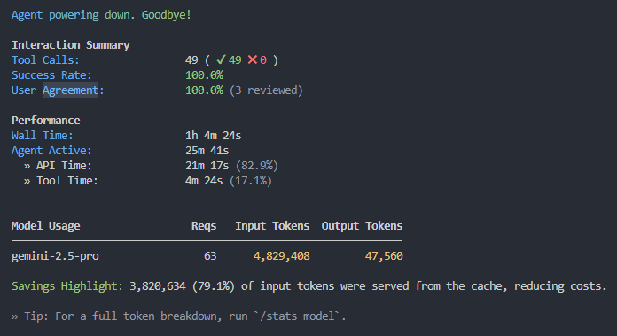

# 대시보드 리로드 현상 분석 및 해결 과정

## 1. 문제 현상

대시보드 페이지(`Dashboard`)에서 처음으로 노트 목록(`NoteList`)의 아이템을 클릭했을 때, 노트 상세 내용(`Editor`)이 로드되는 대신 대시보드 전체가 로딩 화면(`DashboardLoader`)으로 대체되는 심각한 UX 문제가 발생했습니다. 이 현상은 첫 클릭 시에만 발생하며, 이후에는 정상적으로 동작하는 것처럼 보였습니다.

## 2. 잘못된 가설과 분석 과정

이 문제를 해결하기 위해 여러 가설을 세우고 검증했습니다.

### 가설 1: 전역 상태 관리 문제

- **가설**: `fetchNoteContent` 함수가 `useNotes` 훅의 전역 `loading` 상태를 `true`로 잘못 변경하여 전체 로더가 표시된다.
- **검증**: `useNotes.ts` 코드를 분석한 결과, `loading` 상태는 컴포넌트 첫 마운트 시 초기 데이터 로드에만 사용될 뿐, `fetchNoteContent` 함수 내에서는 전혀 호출되지 않았습니다. **이 가설은 기각되었습니다.**

### 가설 2: 인증 상태 변경으로 인한 재마운트

- **가설**: 노트 클릭 시 발생하는 API 호출(`fetchNoteContent`)이 Supabase의 인증 토큰 갱신을 유발하고, 이로 인해 `useAuth` 훅의 `user` 객체 참조가 변경된다. 이 변경이 `ProtectedRoute`를 재실행시켜 `Dashboard` 컴포넌트 전체를 `unmount` 후 다시 `mount` 시킨다.
- **검증**: `useAuth.ts`를 분석한 결과, `useEffect`의 의존성 배열에 `user` 객체 전체가 포함되어 있어 충분히 발생 가능한 시나리오였습니다. 이에 따라 의존성을 `user.id`로 변경하는 최적화를 진행했습니다. 하지만 이것이 근본 원인은 아니었습니다.

## 3. 진짜 원인: Suspense 경계의 부재

며칠 동안 해결되지 않았던 문제의 원인은 의외로 간단한 곳에 있었습니다. 바로 **`React.Suspense`의 동작 원리**와 관련이 있었습니다.

1.  `dashboard/index.tsx` 내에서 `NoteList`와 `Editor` 컴포넌트는 `React.lazy()`를 통해 비동기적으로 로드됩니다.
2.  React는 `lazy` 컴포넌트의 코드를 로드하는 동안 렌더링을 **일시 중단(suspend)** 합니다.
3.  렌더링이 중단되면, React는 가장 가까운 상위 `Suspense` 컴포넌트를 찾아 `fallback` UI를 렌더링합니다.
4.  **문제의 핵심**: `dashboard/index.tsx`의 `notes` 탭 내부에는 `NoteList`와 `Editor`를 감싸는 개별 `Suspense` 경계가 없었습니다.
5.  따라서 렌더링 중단 이벤트는 부모로, 또 그 부모로 계속 전파되다가, 결국 최상위인 `App.tsx`에 설정된 `<Suspense fallback={<DashboardLoader />}>`에 도달했습니다.
6.  이로 인해 React는 `DashboardLoader`를 렌더링했고, 사용자 입장에서는 마치 대시보드 전체가 다시 로드되는 것처럼 보이게 된 것입니다.

## 4. 해결책

`dashboard/index.tsx` 파일에서 `lazy`로 로드되는 각 컴포넌트를 개별 `Suspense` 컴포넌트로 감싸고, 각각에 맞는 스켈레톤 로더(`NoteListLoader`, `EditorLoader`)를 `fallback`으로 지정했습니다.

```tsx
// 수정 전
<div className="w-full md:w-1/3">
  <NoteList ... />
</div>
<div className="w-full md:w-2/3">
  <Editor ... />
</div>

// 수정 후
<div className="w-full md:w-1/3">
  <Suspense fallback={<NoteListLoader />}>
    <NoteList ... />
  </Suspense>
</div>
<div className="w-full md:w-2/3">
  <Suspense fallback={<EditorLoader />}>
    <Editor ... />
  </Suspense>
</div>
```

이 수정을 통해 렌더링 중단이 `App.tsx`까지 전파되는 것을 막고, 로딩이 필요한 컴포넌트의 위치에만 정확한 스켈레톤 UI가 표시되도록 하여 문제를 해결했습니다.


