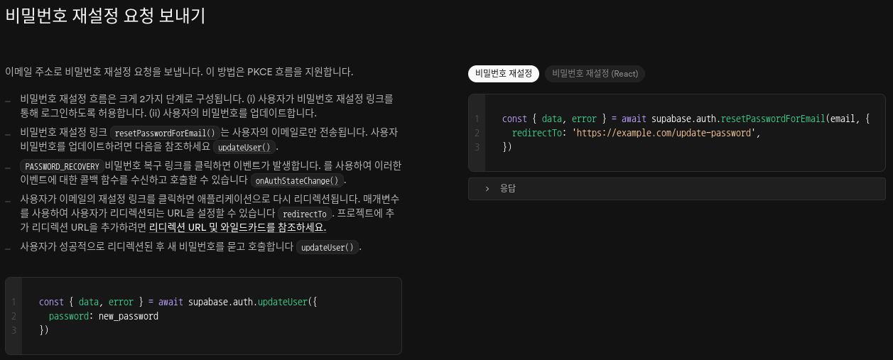

#### 오늘/내일 할 것들

Login Logic Complete O
OAuth 로그인 성능이슈 해결 O
AuthCallback Error / 성능이슈 해결 O
이메일 없이 회원가입 로직 수정 O

IP 회원가입 제한 걸기 O
로딩 UI들 정상화 Toast Message 재정비, 최적화 O
Social Login할 때 로딩 설정하기 O

Darkmode, Light, System Mode, Classic Dark 개발 
플젝 파일구조 정리

====================================================================

Personal Growth Diary 다마고치(썸원, 듀오링고 참새) 키우미
Remote Obsidian note idea
google form or naver form 같은 기능 확장으로 추가 

====================================================================

fix: - 버그 수정 시
feat: - 새로운 기능 추가 시
chore: - 유지보수 및 설정 변경 시
docs: - 문서 변경 시
style: - 코드 스타일 수정 시 (로직 변경 없음)
refactor: - 리팩토링 (기능 변경 없이 코드 구조 개선)
test: - 테스트 추가 또는 수정 시
perf - 성능 개선
design - 디자인 변경

====================================================================

춘유록색 #DCEAA2
취람색 #68C7C1
양람색 #9281CD
벽자색 #8C9ED9
장단색 #D8634F
설백색 #E2E7E4

