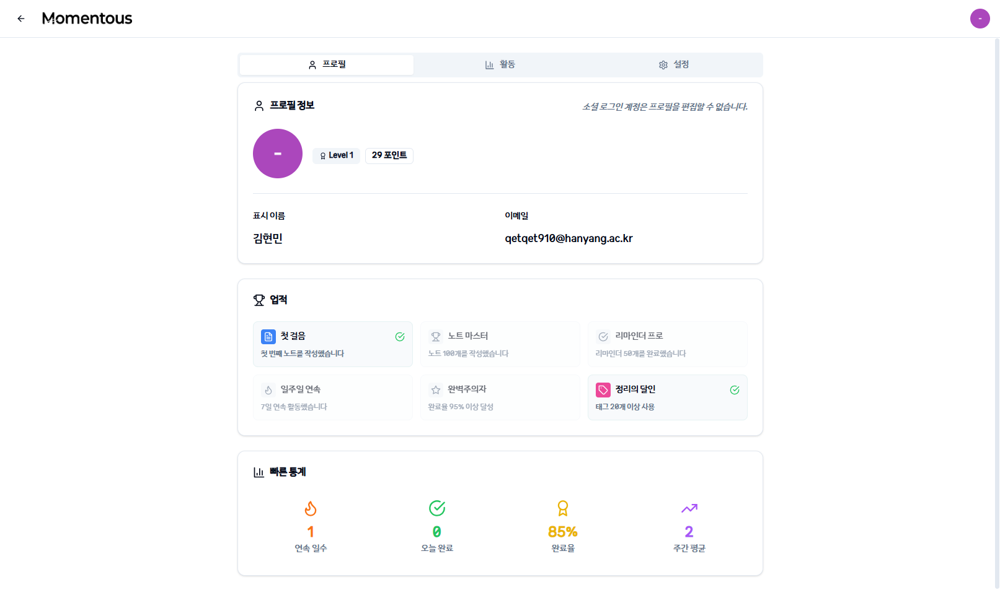

# Momentous (또는 프로젝트 이름)

[](https://app.netlify.com/sites/YOUR_NETLIFY_SITE_NAME/deploys)

<br>

<p align="center">
  
</p>

<h1 align="center">Momentous</h1>

<p align="center">
  <strong>생각의 조각을 #태그로 엮고, 중요한 약속은 @리마인더로 깨우세요.</strong>
  <br>
  마크다운으로 자유롭게 기록하고, 태그 하나로 생각을 정리하며, 일상 속 중요한 약속까지 관리하는<br>가장 가볍고 빠른 당신의 새로운 생산성 도구입니다.
</p>
<p align="center">
    <a href="https://your-deploy-url.com"><strong>🔗 서비스 바로가기</strong></a>
</p>

<br>



## ✨ 핵심 기능

- **#태그 기반 노트 정리**: 모든 노트에 `#프로젝트`, `#아이디어` 등 자유로운 태그를 붙여 생각을 체계적으로 분류하고 연결하세요.
- **@간편 리마인더**: 노트 작성 중 `@내일 3시 회의`처럼 약속을 기록하면, 해당 시간에 정확히 알려주는 스마트 리마인더 기능.
- **마크다운 지원**: 표준 마크다운 문법을 완벽하게 지원하여, 작성한 콘텐츠를 Obsidian, 블로그 등 다른 플랫폼으로 손쉽게 옮길 수 있습니다.
- **빠른 속도와 접근성**: 군 복무 경험에서 착안하여, 어떤 저사양 환경에서도 빠르고 가볍게 작동하도록 최적화되었습니다. 별도 설치 없이 웹에서 바로 사용 가능합니다.
- **실시간 동기화**: 모든 기기에서 작성한 내용이 실시간으로 안전하게 동기화됩니다.

## 🛠️ 기술 스택

- **Frontend**: Vite, React, TypeScript, TailwindCSS, shadcn/ui
- **State Management**: Zustand
- **Backend & DB**: Supabase (PostgreSQL, Auth, Realtime)
- **Animation**: Framer Motion

## 🚀 시작하기

프로젝트를 로컬 환경에서 실행하려면 아래의 단계를 따라주세요.

1.  **저장소 복제**

    ```bash
    git clone [https://github.com/your-username/your-repo-name.git](https://github.com/your-username/your-repo-name.git)
    cd your-repo-name
    ```

2.  **패키지 설치**

    ```bash
    npm install
    ```

3.  **환경 변수 설정**

    - 프로젝트 루트에 `.env` 파일을 생성하세요.
    - Supabase 프로젝트의 URL과 ANON KEY를 아래와 같이 추가합니다.
      ```
      VITE_SUPABASE_URL=YOUR_SUPABASE_URL
      VITE_SUPABASE_ANON_KEY=YOUR_SUPABASE_ANON_KEY
      ```

4.  **개발 서버 실행**
    ```bash
    npm run dev
    ```
    서버가 실행되면 `http://localhost:5173` (또는 다른 포트)에서 앱을 확인할 수 있습니다.

[MIT License](./LICENSE) / [Contributing](./CONTRIBUTING.md)
