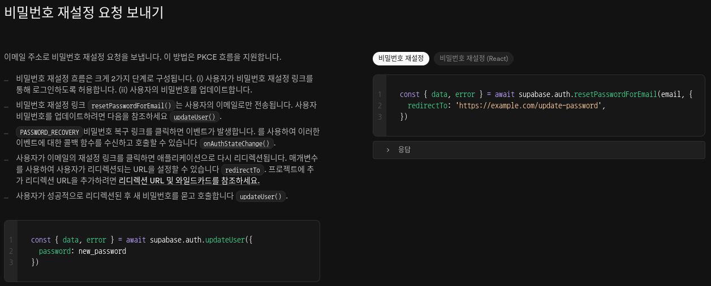

#### 오늘/내일 할 것들

```ruby
Login Logic Complete O
OAuth 로그인 성능이슈 해결 O
AuthCallback Error / 성능이슈 해결 O
이메일 없이 회원가입 로직 수정 O

IP 회원가입 제한 걸기 O
로딩 UI들 정상화 Toast Message 재정비, 최적화 O
Social Login할 때 로딩 설정하기 O

Darkmode, Light, System Mode, Classic Dark 개발 O
플젝 파일구조 정리 O - types부터 이어서 하기 O

Supabase 수정 및 개선 O
사용자별 개인 대시보드 연결 O 및 생성 및 저장 
```

====================================================================<br/>

Personal Growth Diary 다마고치(썸원, 듀오링고 참새) 키우미<br/>
Remote Obsidian note idea<br/>
google form or naver form 같은 기능 확장으로 추가 <br/>

====================================================================<br/><br/>

fix: - 버그 수정 시<br/>
feat: - 새로운 기능 추가 시<br/>
chore: - 유지보수 및 설정 변경 시<br/>
docs: - 문서 변경 시<br/>
style: - 코드 스타일 수정 시 (로직 변경 없음)<br/>
refactor: - 리팩토링 (기능 변경 없이 코드 구조 개선)<br/>
test: - 테스트 추가 또는 수정 시<br/>
perf - 성능 개선<br/>
design - 디자인 변경<br/>

====================================================================<br/><br/>

춘유록색 #DCEAA2<br/>
취람색 #68C7C1<br/>
양람색 #9281CD<br/>
벽자색 #8C9ED9<br/>
장단색 #D8634F<br/>
설백색 #E2E7E4<br/>

====================================================================<br/><br/>

assets: 정적 리소스를 저장
이미지, 아이콘, 애니메이션 등 미디어 파일<br/><br/>

components: UI 요소들을 저장
features: 비즈니스 로직을 포함한 특정 기능 컴포넌트
ui: 재사용 가능한 순수 UI 컴포넌트 (stateless)<br/><br/>

config: 환경 설정 관련 파일
API 엔드포인트, 환경 변수, 상수 등<br/><br/>

hooks: 커스텀 React 훅
재사용 가능한 상태 로직과 사이드 이펙트<br/><br/>

layouts: 페이지 레이아웃 컴포넌트
헤더, 푸터, 사이드바, 네비게이션 바 등<br/><br/>

pages: 라우트에 매핑되는 페이지 컴포넌트
각 URL 경로에 해당하는 최상위 컴포넌트<br/><br/>

services: 외부 서비스와의 통신 로직
API 호출, 데이터 가공, 인증 서비스 등<br/><br/>

stores: 상태 관리 로직
Zustand, Redux, Context API 등의 상태 저장소<br/><br/>

styles: 전역 스타일 및 테마 관련 파일
글로벌 CSS, 테마 변수, 믹스인 등<br/><br/>

types: 타입스크립트 타입 정의
인터페이스, 타입, 열거형 등<br/><br/>

utils: 유틸리티 함수
날짜 포맷팅, 문자열 처리, 수학 함수 등<br/><br/>

public: 정적 파일
서비스 워커, 매니페스트, 파비콘, 아이콘 등<br/><br/>

```js
전체적인 구조 패턴
이 구조는 주로 **기능 중심 아키텍처(Feature-oriented Architecture)**로 구성되어 있으며, 이는 대규모 프로젝트에서 기능별로 코드를 분리하여 유지보수성을 높이는 데 효과적입니다. 또한 아토믹 디자인 시스템(Atomic Design System) 원칙을 UI 컴포넌트에 적용하고 있는 것으로 보입니다.
이러한 구조는 확장성이 좋고, 새로운 개발자가 프로젝트에 쉽게 적응할 수 있으며, 기능별로 분리되어 있어 코드의 응집도를 높이고 결합도를 낮추는 데 도움이 됩니다.
```


