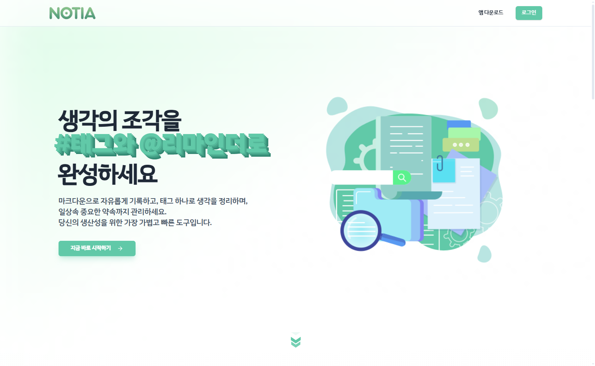
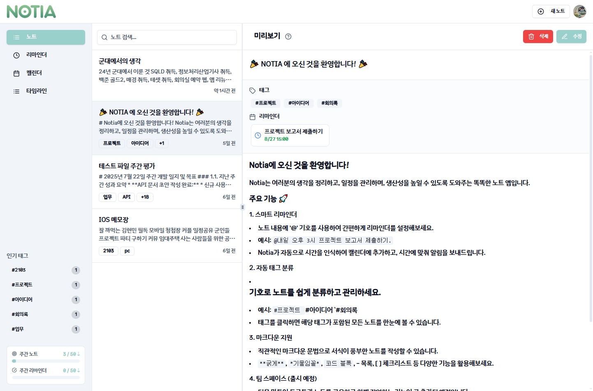
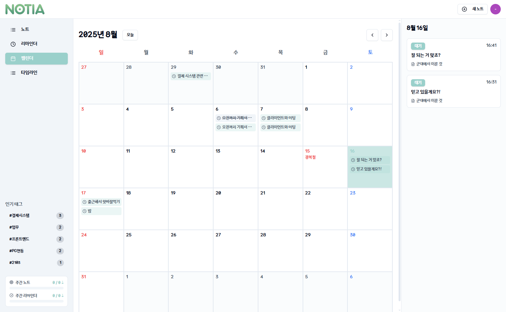

# Notia [](https://app.netlify.com/projects/wedontlikeamnesia/deploys)

<br>

<p align="center">
  
</p>

<p align="center">
  <strong>생각의 조각을 #태그로 엮고, 중요한 약속은 @리마인더로 깨우세요.</strong>
  <br>
  마크다운으로 자유롭게 기록하고, 태그 하나로 생각을 정리하며, 일상 속 중요한 약속까지 관리하는<br>가장 가볍고 빠른 당신의 새로운 생산성 도구입니다.
</p>
<p align="center">
    <a href="https://notia.site"><strong>🔗 서비스 바로가기</strong></a>
</p>

## ✨ 핵심 기능

- **#태그 기반 노트 정리**: 모든 노트에 `#프로젝트`, `#아이디어` 등 자유로운 태그를 붙여 생각을 체계적으로 분류하고 연결합니다.
- **@간편 리마인더**: 노트 작성 중 `@2시 10분 회의`처럼 약속을 기록하면, 해당 시간에 정확히 알려주는 스마트 리마인더입니다.
- **마크다운 지원**: 표준 마크다운 문법과 Mermaid문법을 완벽하게 지원하여, 작성한 콘텐츠를 Obsidian, 블로그 등 다른 플랫폼으로 손쉽게 옮길 수 있습니다.
- **빠른 속도와 접근성**: 군 복무 경험에서 착안하여, 어떤 저사양 환경에서도 빠르고 가볍게 작동하도록 최적화되었습니다. 별도 설치 없이 웹에서 바로 사용 가능합니다.
- **실시간 동기화**: 모든 기기에서 작성한 내용이 실시간으로 안전하게 동기화됩니다.
- **사용자 맞춤 플랫폼**: 사용자의 환경에 따라, 웹, 웹앱, 데스크탑 앱 등 알맞게 사용하세요.

<br>

## 📸 주요 화면

아래는 현재 프로젝트의 메인 주요 화면들입니다.

| 랜딩 페이지                                         | 대시보드 페이지                                    | 캘린더 페이지                                    |
| --------------------------------------------------- | -------------------------------------------------- | ------------------------------------------------ |
|  |  |  |

<br>

## 📖 사용법

Notia의 핵심은 간단한 기호를 사용한 빠른 정리입니다.

- **태그 추가**: 노트 내용 어디에서든 `#` 기호 뒤에 원하는 단어를 입력하세요.

  > `오늘 회의 내용 정리 #업무 #회의록`

- **리마인더 설정**: `@` 기호 뒤에 시간을 쓰고, 마침표(`.`)로 문장을 끝내세요.

  > `내일 오후 3시에 클라이언트 미팅하기.` → `@내일 3시 클라이언트 미팅.`

  > `1시간 10분 뒤 회의 자료 확인하기.` → `@1시간 10분 회의 자료 확인하기.`

<br><br>

## 🛠️ 기술 스택

- **Frontend**: React, TypeScript, TailwindCSS, shadcn/ui
- **State Management**: Zustand
- **Backend & DB**: Supabase (PostgreSQL, Auth, Realtime)
- **Animation**: Framer Motion
- **Build Tool**: Vite
- **Package Manager**: npm

<br><br>

## 🚀 시작하기

프로젝트를 로컬 환경에서 실행하려면 아래의 단계를 따라주세요.

1.  **저장소 복제**

    ```bash
    git clone [https://github.com/qetqet910/Notia.git](https://github.com/qetqet910/Notia.git)
    cd Notia
    ```

2.  **의존성 패키지 설치**

    ```bash
    npm install
    ```

3.  **환경 변수 설정**

[env example](.env.example)

4.  **개발 서버 실행**
    ```bash
    npm run dev
    ```
    서버가 실행되면 `http://localhost:5173` 에서 앱을 확인할 수 있습니다.

<br><br>

## 만든 계기

24년 군대에선 자격증 위주로, 부대에 적응하며, 새로운 취미를 찾으며, 알고리즘 문제를 풀며 시간을 보냈고 <br/> 25년은 제대로된 프로젝트를 만들고 싶었다 그동안 제대로 하나 완성한 프로젝트가 없기 때문에 <br/>나도 할 수 있다는 걸 나에게 알려주고 싶었다 그래서 사소한 디테일 하나 보고 또 보았으며 <br/>그래서 개발 소요 시간이 예상한 것 보다 3달이 더 걸렸지만 그래도 만족한다

[CC BY-NC-SA 4.0 License](./LICENSE) / [Contributing](./CONTRIBUTING.md) / [후원한잔](https://acoffee.shop/d/00be6d8a-5e3e-494e-a559-0c2f4bb1c25f)
